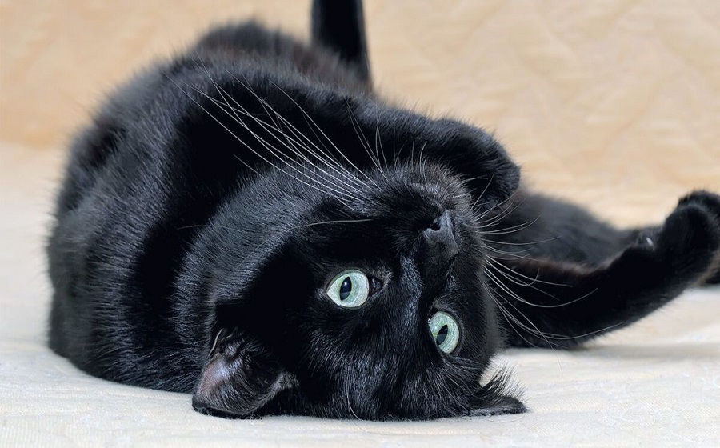

## THE BLACK CAT

__Written by Edgar Allan Poe__

__Published on https://www.classicshorts.com/stories/blackcat.html__

__Genre: Fiction Horror__

For the most wild, yet most homely narrative which I am about to pen, I neither expect nor solicit belief. But tomorrow I die, and today I will unburden my soul. My immediate purpose is to place before the world, plainly, succinctly, and without comment, a series of mere household events. In their consequences, these events have terrified - have tortured - have destroyed me. 

From my infancy I was noted for the docility and humanity of my disposition. My tenderness of heart was even so conspicuous as to make me the jest of my companions. I was especially fond of animals, and was indulged by my parents with a great variety of pets. With these I spent most of my time, and never was so happy as when feeding and caressing them. There is something in the unselfish and self-sacrificing love of a brute, which goes directly to the heart of him who has had frequent occasion to test the paltry friendship and gossamer fidelity of mere Man.

I married early, and was happy to find in my wife a disposition not uncongenial with my own. Observing my partiality for domestic pets, she lost no opportunity of procuring those of the most agreeable kind. We had birds, gold-fish, a fine dog, rabbits, a small monkey, and a cat.

This latter was a remarkably large and beautiful animal, entirely black, and sagacious to an astonishing degree. Pluto - this was the cat's name - was my favorite pet and playmate. I alone fed him, and he attended me wherever I went about the house. It was even with difficulty that I could prevent him from following me through the streets.

Our friendship lasted, in this manner, for several years, during which my general temperament and character - through the instrumentality of the Fiend Intemperance - had experienced a radical alteration for the worse. I grew, day by day, more moody, more irritable, more regardless of the feelings of others. I allowed myself to use intemperate language to my wife. At length, I even offered her personal violence. My pets, of course, were made to feel the change in my disposition. I not only neglected, but ill-treated them. For Pluto, however, I still retained sufficient regard to restrain me from maltreating him. But my disease grew upon me - for what disease is like Alcohol! - and at length even Pluto, who was now becoming old, and consequently somewhat peevish - even Pluto began to experience the effects of my ill temper.

One night, returning home, much intoxicated, from one of my haunts about town, I noticed the cat avoided my presence. I seized him; but in his fright at my violence, he inflicted a slight wound upon my hand with his teeth. The fury of a demon instantly possessed me. I no longer knew myself. My original soul seemed, at once, to take its flight from my body and a more than fiendish, gin-nurtured malevolence thrilled every fibre of my frame. I took from my waistcoat-pocket a pen-knife, opened it, grasped the poor beast by the throat, and deliberately cut one of its eyes from the socket! I blush, I burn, I shudder, while I pen the damnable atrocity.

When reason returned with the morning - I experienced a sentiment half of horror, half of remorse, for the crime of which I had been guilty; but the soul remained untouched. I again plunged into excess, and soon drowned in wine all memory of the deed.

In the meantime the cat slowly recovered. The socket of the lost eye presented a frightful appearance, but he no longer appeared to suffer any pain. He went about the house as usual, but, as might be expected, fled in extreme terror at my approach. I had so much of my old heart left, as to be at first grieved by this evident dislike on the part of a creature which had once so loved me. But this feeling soon gave way to irritation. And then came, as if to my final and irrevocable overthrow, the spirit of PERVERSENESS. Of this spirit philosophy takes no account. Yet I am not more sure that my soul lives, than I am that perverseness is one of the primitive impulses of the human heart who has not, a hundred times, found himself committing a vile or a silly action, for no other reason than because he knows he should not? One morning, in cold blood, I slipped a noose about its neck and hung it to the limb of a tree; - hung it with the tears streaming from my eyes, and with the bitterest remorse at my heart; - hung it because I knew that it had loved me, and because I felt it had given me no reason of offence.

On the night of the day on which this cruel deed was done, I was aroused from sleep by the cry of fire. The curtains of my bed were in flames. The whole house was blazing. It was with great difficulty that my wife, a servant, and myself, made our escape from the conflagration. The destruction was complete. My entire worldly wealth was swallowed up, and I resigned myself thenceforward to despair.

I am detailing a chain of facts - and wish not to leave even a possible link imperfect. On the day succeeding the fire, I visited the ruins. The walls, with one exception, had fallen in. This exception was found in a compartment wall, not very thick, which stood about the middle of the house, and against which had rested the head of my bed. The plastering had here, in great measure, resisted the action of the fire - a fact which I attributed to its having been recently spread. About this wall a dense crowd was gathered, and many people seemed to be examining a particular portion of it with very eager attention. The words "strange!" "singular!" and other similar expressions, excited my curiosity. I approached and saw, as if graven in base relief upon the white surface, the figure of a gigantic cat. The impression was given with an accuracy truly marvellous. There was a rope about the animal's neck.

When I first beheld this apparition - for I could scarcely regard it as less - my wonder and my terror were extreme. But at length reflection came to my aid. The cat, I remembered, had been hung in a garden adjacent to the house. Upon the alarm of fire, this garden had been immediately filled by the crowd - by some one of whom the animal must have been cut from the tree and thrown, through an open window, into my chamber. This had probably been done with the view of arousing me from sleep. The falling of other walls had compressed the victim of my cruelty into the substance of the freshly-spread plaster; the lime of which, with the flames, and the ammonia from the carcass, had then accomplished the portraiture as I saw it.

Although I readily accounted for my reason, if not altogether to my conscience, but for months I could not rid myself of the phantasm of the cat; and, during this period, there came back into my spirit a half-sentiment that seemed, but was not remorse. I went so far as to regret the loss of the animal, and to look about me, among the vile haunts which I now habitually frequented, for another pet of the same species, and of somewhat similar appearance, with which to supply its place.

One night as I sat, my attention was suddenly drawn to some black object, reposing upon the head of one of the immense hogsheads of Gin, or of Rum, which constituted the chief furniture of the apartment. I had been looking steadily at the top of this hogshead for some minutes, and what now caused me surprise was the fact that I had not sooner perceived the object thereupon. I approached it, and touched it with my hand. It was a black cat - a very large one - fully as large as Pluto, and closely resembling him in every respect but one. Pluto had not a white hair upon any portion of his body; but this cat had a large, although indefinite splotch of white, covering nearly the whole region of the breast. Upon my touching him, he immediately arose, purred loudly, rubbed against my hand, and appeared delighted with my notice. This, then, was the very creature of which I was in search. I at once offered to purchase it off the landlord; but this person made no claim to it - knew nothing of it - had never seen it before.

I continued my caresses, and, when I prepared to go home, the animal evinced a disposition to accompany me. I permitted it to do so; occasionally stooping and patting it as I proceeded. When it reached the house it domesticated itself at once, and became immediately a great favorite with my wife.

For my own part, I soon found a dislike to it arising within me, which was just the reverse of what I had anticipated; but I know not how or why it was - its evident fondness for me rather disgusted and annoyed me. By slow degrees, these feelings of disgust and annoyance rose into the bitterness of hatred. What added, no doubt, to my hatred of the beast, was the discovery, on the morning after I brought it home, that, like Pluto, it also had been deprived of one of its eyes. This circumstance, however, only endeared it to my wife.

With my aversion to this cat, however, it followed my footsteps with a pertinacity which it would be difficult to make the reader comprehend. Whenever I sat, it would crouch beneath my chair, or spring upon my knees, covering me with its loathsome caresses. If I arose to walk it would get between my feet and thus nearly throw me down. At such times, although I longed to destroy it with a blow, I was yet withheld from so doing, partly by a memory of my former crime, but chiefly - let me confess it at once - by absolute dread of the beast.

This dread was not exactly a dread of physical evil - and yes, even in this felon's cell, I am almost ashamed to own - that the terror and horror with which the animal inspired me, had been heightened by one of the merest chimaeras that could be conceived. My wife had called my attention, more than once, to the character of the mark of white hair, of which I have spoken, and which constituted the sole visible difference between the strange beast and the one I had destroyed. The reader will remember that this mark, although large, had been originally very indefinite; but, by slow degrees nearly imperceptible, and which for a long time my Reason struggled to reject as fanciful - it had, at length, assumed a rigorous distinctness of outline. It was now the representation of an object that I shudder to name - the image of a hideous ghastly thing - The GALLOWS! 

Alas! Neither by day nor by night knew I the blessing of Rest any more! During the former the creature left me no moment alone; and, in the latter, I started, hourly, from dreams of unutterable fear, to find the hot breath of the thing upon my face, and its vast weight - incumbent eternally upon my heart!

Beneath the pressure of torments such as these, the feeble remnant of the good within me succumbed. The darkest and most evil of thoughts became my sole intimates. The moodiness of my usual temper increased to hatred of all things and of all mankind; while, from the sudden, frequent, and ungovernable outbursts of fury to which I now blindly abandoned myself, my uncomplaining wife, alas! was the most usual and the most patient of sufferers.

One day she accompanied me, upon some household errand, into the cellar of the old building which our poverty compelled us to inhabit. The cat followed me down the steep stairs, and, nearly throwing me headlong, exasperated me to madness. Uplifting an axe, and forgetting, in my wrath, the childish dread that restrained me, I aimed a blow at the animal which, of course, would have proved instantly fatal had it descended as I wished. But this blow was arrested by the hand of my wife. Goaded, by the interference, into a rage more than demoniacal, I withdrew my arm from her grasp and buried the axe in her brain. She fell dead upon the spot, without a groan.

This hideous murder accomplished, I set myself with entire deliberation, to the task of concealing the body. I knew that I could not remove it from the house, either by day or by night, without the risk of being observed by the neighbors. Finally I hit upon what I considered a far better expedient option. I determined to wall it up in the cellar - as the monks of the middle ages are recorded to have walled up their victims.

For a purpose such as this the cellar was well adapted. Its walls were loosely constructed, and had lately been plastered throughout with a rough plaster, which the dampness of the atmosphere had prevented from hardening. By means of a crow-bar I easily dislodged the bricks, and, having carefully deposited the body against the inner wall, I re-laid the whole structure as it originally stood. Having procured mortar, sand, and hair, with every possible precaution, I prepared a plaster which could not be distinguished from the old, and with this I very carefully went over the new brickwork. When I had finished, I felt satisfied that the wall did not present the slightest appearance of having been disturbed. 

My next step was to look for the beast which had been the cause of so much wretchedness; for I had, at length, firmly resolved to put it to death. But it appeared that the crafty animal had been alarmed at the violence of my previous anger, and refused to present itself in my present mood. It did not make its appearance during the night - and thus for one night at least, since its introduction into the house, I soundly and tranquilly slept even with the burden of murder upon my soul!

The second and the third day passed with my tormentor having fled the premises! I should behold it no more! My happiness was supreme! The guilt of my dark deed disturbed me but little. Some few inquiries had been made, but these had been readily answered. Even a search had been instituted - but of course nothing was to be discovered. I looked upon my future felicity as secure.

Upon the fourth day of the assassination, a party of the police came, very unexpectedly, into the house, and proceeded again to make rigorous investigation of the premises. The officers requested my company in their search. They left no nook or corner unexplored. At length, for the third or fourth time, they descended into the cellar. My heart beat calmly as that of one who slumbers in innocence. I walked about the cellar from end to end with my arms upon my bosom, and roamed easily to and fro. The police were thoroughly satisfied and prepared to depart. The glee at my heart was too strong to be restrained. I burned to say if but one word, by way of triumph, and to render doubly sure their assurance of my guiltlessness.

"Gentlemen," I said at last, as the party ascended the steps, "I delight to have allayed your suspicions. I wish you all health, and a little more courtesy. By the way, gentlemen, this is a very well constructed house." These walls are you going, gentlemen? - these walls are solidly put together;" and here, through the mere frenzy of bravado, I rapped heavily, with a cane which I held in my hand, upon that very portion of the brick-work behind which stood the corpse of the wife of my bosom.

But may God shield and deliver me from the fangs of the Arch-Fiend! No sooner had the reverberation of my blows sunk into silence, than I was answered by a voice from within the tomb! - by a cry, at first muffled and broken, like the sobbing of a child, and then quickly swelling into one long, loud, and continuous scream, utterly anomalous and inhuman - a howl - a wailing shriek, half of horror and half of triumph, such as might have arisen only out of hell.

Swooning, I staggered to the opposite wall. For one instant the party upon the stairs remained motionless, through extremity of terror and of awe. In the next, a dozen stout arms were toiling at the wall. It fell bodily. The corpse, already greatly decayed and clotted with gore, stood erect before the eyes of the spectators. Upon its head, with red extended mouth and solitary eye of fire, sat the hideous beast whose craft had seduced me into murder, and whose informing voice had consigned me to the hangman. I had walled the monster up within the tomb!

## THE GIFT OF THE MAGIS

__Written by O. Henry__

__Published on https://www.classicshorts.com/stories/magi.html__

__Genre: Fiction__

One dollar and eighty-seven cents. That was all. And sixty cents of it was in pennies. Pennies saved one and two at a time by bulldozing the grocer and the vegetable man and the butcher until one's cheeks burned with the silent imputation of parsimony that such close dealing implied. Three times Della counted it. One dollar and eighty-seven cents. And the next day would be Christmas.

There was clearly nothing left to do but flop down on the shabby little couch and howl. So Della did it. Which instigates the moral reflection that life is made up of sobs, sniffles, and smiles, with sniffles predominating.

While the mistress of the home is gradually subsiding from the first stage to the second, take a look at the home. A furnished flat at $8 per week. It did not exactly beggar description, but it certainly had that word on the look-out for the mendicancy squad.

In the vestibule below was a letter-box into which no letter would go, and an electric button from which no mortal finger could coax a ring. Also appertaining thereunto was a card bearing the name "Mr. James Dillingham Young."

The "Dillingham" had been flung to the breeze during a former period of prosperity when its possessor was being paid $30 per week. Now, when the income was shrunk to $20, the letters of "Dillingham" looked blurred, as though they were thinking seriously of contracting to a modest and unassuming D. But whenever Mr. James Dillingham Young came home and reached his flat above he was called "Jim" and greatly hugged by Mrs. James Dillingham Young, already introduced to you as Della. Which is all very good.

Della finished her cry and attended to her cheeks with the powder rag. She stood by the window and looked out dully at a grey cat walking a grey fence in a grey backyard. To-morrow would be Christmas Day, and she had only $1.87 with which to buy Jim a present. She had been saving every penny she could for months, with this result. Twenty dollars a week doesn't go far. Expenses had been greater than she had calculated. They always are. Only $1.87 to buy a present for Jim. Her Jim. Many-a-happy-hour she had spent planning for something nice for him. Something fine and rare and sterling--something just a little bit near to being worthy of the honour of being owned by Jim.

There was a pier-glass between the windows of the room. Perhaps you have seen a pier-glass in an $8 flat. A very thin and very agile person may, by observing his reflection in a rapid sequence of longitudinal strips, obtain a fairly accurate conception of his looks. Della, being slender, had mastered the art.

Suddenly she whirled from the window and stood before the glass. Her eyes were shining brilliantly, but her face had lost its colour within twenty seconds. Rapidly she pulled down her hair and let it fall to its full length.

Now, there were two possessions of the James Dillingham Youngs in which they both took a mighty pride. One was Jim's gold watch that had been his father's and his grandfather's. The other was Della's hair. Had the Queen of Sheba lived in the flat across the airshaft, Della would have let her hair hang out of the window some day to dry just to depreciate Her Majesty's jewels and gifts. Had King Solomon been the janitor, with all his treasures piled up in the basement, Jim would have pulled out his watch every time he passed, just to see him pluck at his beard from envy.

So now Della's beautiful hair fell about her, rippling and shining like a cascade of brown waters. It reached below her knee and made itself almost a garment for her. And then she did it up again nervously and quickly. Once she faltered for a minute and stood still while a tear or two splashed on the worn red carpet.

On went her old brown jacket; on went her old brown hat. With a whirl of skirts and with the brilliant sparkle still in her eyes, she cluttered out of the door and down the stairs to the street.

Where she stopped the sign read: "Mme Sofronie. Hair Goods of All Kinds." One Eight up Della ran, and collected herself, panting. Madame, large, too white, chilly, hardly looked the "Sofronie."

"Will you buy my hair?" asked Della.

"I buy hair," said Madame. "Take yer hat off and let's have a sight at the looks of it."

Down rippled the brown cascade.

"Twenty dollars," said Madame, lifting the mass with a practiced hand.

"Give it to me quick" said Della.

Oh, and the next two hours tripped past on rosy wings. Forget the hashed metaphor. She was ransacking the stores for Jim's present.

She found it at last. It surely had been made for Jim and no one else. There was no other like it in any of the stores, and she had turned all of them inside out. It was a platinum fob chain simple and chaste in design, properly proclaiming its value by substance alone and not by meretricious ornamentation--as all good things should do. It was even worthy of The Watch. As soon as she saw it she knew that it must be Jim's. It was like him. Quietness and value--the description applied to both. Twenty-one dollars they took from her for it, and she hurried home with the 78 cents. With that chain on his watch Jim might be properly anxious about the time in any company. Grand as the watch was, he sometimes looked at it on the sly on account of the old leather strap that he used in place of a chain.

When Della reached home her intoxication gave way a little to prudence and reason. She got out her curling irons and lighted the gas and went to work repairing the ravages made by generosity added to love. Which is always a tremendous task dear friends--a mammoth task.

Within forty minutes her head was covered with tiny, close-lying curls that made her look wonderfully like a truant schoolboy. She looked at her reflection in the mirror long, carefully, and critically.

"If Jim doesn't kill me," she said to herself, "before he takes a second look at me, he'll say I look like a Coney Island chorus girl. But what could I do--oh! what could I do with a dollar and eighty-seven cents?"

At 7 o'clock the coffee was made and the frying-pan was on the back of the stove hot and ready to cook the chops.

Jim was never late. Della doubled the fob chain in her hand and sat on the corner of the table near the door that he always entered. Then she heard his step on the stair away down on the first flight, and she turned white for just a moment. She had a habit of saying little silent prayers about the simplest everyday things, and now she whispered: "Please, God, make him think I am still pretty."

The door opened and Jim stepped in and closed it. He looked thin and very serious. Poor fellow, he was only twenty-two--and to be burdened with a family! He needed a new overcoat and he was without gloves.

Jim stepped inside the door, as immovable as a setter at the scent of quail. His eyes were fixed upon Della, and there was an expression in them that she could not read, and it terrified her. It was not anger, nor surprise, nor disapproval, nor horror, nor any of the sentiments that she had been prepared for. He simply stared at her fixedly with that peculiar expression on his face.

Della wriggled off the table and went for him.

"Jim, darling," she cried, "don't look at me that way. I had my hair cut off and sold it because I couldn't have lived through Christmas without giving you a present. It'll grow out again--you won't mind, will you? I just had to do it. My hair grows awfully fast. Say 'Merry Christmas!' Jim, and let's be happy. You don't know what a nice-what a beautiful, nice gift I've got for you."

"You've cut off your hair?" asked Jim, laboriously, as if he had not arrived at that patent fact yet, even after the hardest mental labour.

"Cut it off and sold it," said Della. "Don't you like me just as well, anyhow? I'm me without my hair, ain't I?"

Jim looked about the room curiously.

"You say your hair is gone?" he said, with an air-almost of idiocy.

"You needn't look for it," said Della. "It's sold, I tell you--sold and gone, too. It's Christmas Eve, boy. Be good to me, for it went for you. Maybe the hairs of my head were numbered," she went on with a sudden serious sweetness, "but nobody could ever count my love for you. Shall I put the chops on, Jim?"

Out of his trance Jim seemed to quickly wake. He enfolded his Della. For ten seconds let us regard with discreet scrutiny some inconsequential object in the other direction. Eight dollars a week or a million a year--what is the difference? A mathematician or a wit would give you the wrong answer. The magi brought valuable gifts, but that was not among them. This dark assertion will be illuminated later on.

Jim drew a package from his overcoat pocket and threw it upon the table.

"Don't make any mistake, Dell," he said, "about me. I don't think there's anything in the way of a haircut or a shave or a shampoo that could make me like my girl any less. But if you unwrap that package you may see why you had me going a while at first."

White fingers and nimble tore at the string and paper. And then an ecstatic scream of joy; and then, alas! a quick feminine change to hysterical tears and wails, necessitating the immediate employment of all the comforting powers of the lord of the flat.

For there lay The Combs--the set of combs, side and back, that Della had worshipped for long in a Broadway window. Beautiful combs, pure tortoise-shell, with jewelled rims--just the shade to wear in the beautiful vanished hair. They were expensive combs, she knew, and her heart had simply craved and yearned over them without the least hope of possession. And now, they were hers, but the tresses that should have adorned the coveted adornments were gone.

But she hugged them to her bosom, and at length she was able to look up with dim eyes and a smile and say: "My hair grows so fast, Jim!"

And then Della leaped up like a little singed cat and cried, "Oh, oh!"

Jim had not yet seen his beautiful present. She held it out to him eagerly upon her open palm. The dull precious metal seemed to flash with a reflection of her bright and ardent spirit.

"Isn't it a dandy, Jim? I hunted all over town to find it. You'll have to look at the time a hundred times a day now. Give me your watch. I want to see how it looks on it."

Instead of obeying, Jim tumbled down on the couch and put his hands under the back of his head and smiled.

"Dell," said he, "let's put our Christmas presents away and keep 'em a while. They're too nice to use just at present. I sold the watch to get the money to buy Your combs. And now suppose you put the chops on."

The magi, as you know, were wise men--wonderfully wise men-who brought gifts to the Babe in the manger. They invented the art of giving Christmas presents. Being wise, their gifts were no doubt wise ones, possibly bearing the privilege of exchange in case of duplication. And here I have lamely related to you the uneventful chronicle of two foolish children in a flat who most unwisely sacrificed for each other the greatest treasures of their house. But in a last word to the wise of these days let it be said that of all who give gifts these two were the wisest. Of all who give and receive gifts, such as they are wisest. Everywhere they are wisest. They are the magi.
   
## THE KEN OF EINSTEIN COMPREHENSION CHALLENGE

[TEST LINK HERE](https://forms.gle/HT7p5MSYftF4R4g97)

__NOTE:__ The link will only be available at the stipulated time.
