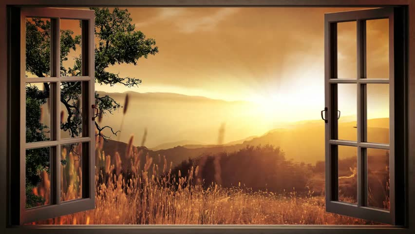

## THE OPEN WINDOW

__Written by H. H. Munro__

__Published on https://classicshorts.com/stories/__

__Genre: Fiction Mystery__

“My aunt will be down presently, Mr. Nuttel,” said a very self-possessed young lady of fifteen; “in the meantime you must try and put up with me.”

Framton Nuttel endeavoured to say the correct ‘something’ which should duly flatter the niece of the moment without unduly discounting the aunt that was to come. Privately, he doubted more than ever whether these formal visits on a succession by total strangers would do much towards helping the nerve cure he was supposed to be undergoing.

“I know how it will be,” his sister had said when he was preparing to migrate to this rural retreat; “you will bury yourself down there and not speak to a living soul, and your nerves will be worse than ever from moping. I shall just give you letters of introduction to all the people I know there. Some of them, as far as I can remember, were quite nice.”

Framton wondered whether Mrs. Sappleton, the lady to whom he was presenting one of the letters of introduction, came into the nice division.

"Do you know many of the people around here?" asked the niece, when she judged that they had had sufficient silent communion.

"Hardly a soul," said Framton. "My sister was staying here, at the rectory, you know, some four years ago, and she gave me letters of introduction to some of the people here." He made the last statement in a tone of distinct regret.

"Then you know practically nothing about my aunt?" pursued the self-possessed young lady. "Only her name and address," admitted the caller. He was wondering whether Mrs. Sappleton was in the married or widowed state. An undefinable something about the room seemed to suggest masculine habitation.

"Her great tragedy happened just three years ago," said the child; "that would be since your sister's time."

"Her tragedy?" asked Framton; somehow in this restful country spot tragedies seemed out of place.

"You may wonder why we keep that window wide open on an October afternoon," said the niece, indicating a large French window that opened onto a lawn.

"It is quite warm for the time of the year," said Framton; "but has that window got anything to do with the tragedy?"

"Out through that window, three years ago today, her husband and her two young brothers went off for their day's shooting. They never came back. In crossing the moor to their favorite snipe-shooting ground they were all three engulfed in a treacherous piece of bog. It had been that dreadful wet summer, you know, and places that were safe in other years gave way suddenly without warning. Their bodies were never recovered. That was the dreadful part of it." Here the child's voice lost its self-possessed note and became falteringly human. "Poor aunt always thinks that they will come back someday, they and the little brown spaniel that was lost with them, and walk in at that window just as they used to do. That is why the window is kept open every evening till it is quite dusk. Poor dear aunt, she has often told me how they went out, her husband with his white waterproof coat over his arm, and Ronnie, her youngest brother, singing 'Bertie, why do you bound?' as he always did to tease her, because she said it got on her nerves. Do you know, sometimes on still, quiet evenings like this, I almost get a creepy feeling that they will all walk in through that window--"

She broke off with a little shudder. It was a relief to Framton when the aunt bustled into the room with a whirl of apologies for being late in making her appearance. "I hope Vera has been amusing you?" she said. "She has been very interesting," said Framton.

"I hope you don't mind the open window," said Mrs. Sappleton briskly; "my husband and brothers will be home directly from shooting, and they always come in this way. They've been out for snipe in the marshes today, so they'll make a fine mess over my poor carpets. So like you menfolk, isn't it?"

She rattled on cheerfully about the shooting and the scarcity of birds, and the prospects for duck in the winter. To Framton it was all purely horrible. He made a desperate but only partially successful effort to turn the talk on to a less ghastly topic, he was conscious that his hostess was giving him only a fragment of her attention, and her eyes were constantly straying past him to the open window and the lawn beyond. It was certainly an unfortunate coincidence that he should have paid his visit on this tragic anniversary.

"The doctors agree in ordering me complete rest, an absence of mental excitement, and avoidance of anything in the nature of violent physical exercise," announced Framton, who labored under the tolerably widespread delusion that total strangers and chance acquaintances are hungry for the least detail of one's ailments and infirmities, their cause and cure. "On the matter of diet they are not so much in agreement," he continued.

"No?" said Mrs. Sappleton, in a voice which only replaced a yawn at the last moment. Then she suddenly brightened into alert attention--but not to what Framton was saying.

"Here they are at last!" she cried. "Just in time for tea, and don't they look as if they were muddy up to the eyes!?"

Framton shivered slightly and turned towards the niece with a look intended to convey sympathetic comprehension. The child was staring out through the open window with a dazed horror in her eyes. In a chill shock of nameless fear, Framton swung round in his seat and looked in the same direction.

Out of the deepening twilight, three figures were walking across the lawn towards the window, they all carried guns under their arms, and one of them was additionally burdened with a white coat hung over his shoulders. A tired brown spaniel kept close at their heels. Noiselessly they neared the house, and then a hoarse young voice chanted out of the dusk: "I said, Bertie, why do you bound?"

Framton grabbed wildly at his stick and hat; the hall door, the gravel drive, and the front gate were dimly noted stages in his headlong retreat. A cyclist coming along the road had to run into the hedge to avoid an imminent collision.

"Here we are, my dear," said the bearer of the white mackintosh, coming in through the window, "fairly muddy, but most of it is dry. Who was that who bolted out as we came up?"

"A most extraordinary man, a Mr. Nuttel," said Mrs. Sappleton; "could only talk about his illnesses, and dashed off without a word of goodbye or apology when you arrived. One would think he had seen a ghost."

"I expect it was the spaniel," said the niece calmly; "he told me he had a horror of dogs. He was once hunted into a cemetery somewhere on the banks of the Ganges by a pack of pariah dogs, and had to spend the night in a newly dug grave with the creatures snarling and grinning and foaming just above him. Enough to make anyone lose their nerve."

Romance at short notice was her speciality.

## THE SECRET

__Written by Christopher Long__

__Published on https://storystar.com/__

__Genre: Fiction Mystery__

I was on my way to interview Bob Waters, the best selling author of “A Gaze Over History”. There were ten books in the series, covering a range of historical events from the Tudors to the abolition of Slavery in the USA. Bob, because of the richness and vividness of his writing, was beloved by critics and readers alike. He possessed the ability to transport the reader to a remote period, while so many history books were flat and uninspiring. Each new book in the series would sell out in a matter of weeks, making him an outstanding writer in his field.

Despite his devoted fan base and the many online forums dedicated to “A Gaze Over History”, little was known about Bob Waters. He very rarely gave interviews or made public appearances, preferring to let his work speak for itself. The only exception he would make to this rule was when a new title was about to be released. I was surprised when on the eve of the release of his eleventh book, my office got a phone call. Local Eye, the online magazine where I work, was hardly the kind of media that someone of Bob Waters’ calibre would usually get in touch with. As the name suggests, we deal with local issues. So, why me? The question kept going around in my head as I drove to Mr Waters’ house that morning. I was also filled with excitement, as I, like many others, was a huge fan.

I pulled up outside his house, walked across the gravel and rang the doorbell. It took a few rings but, eventually, the door opened and I was in the presence of one of my heroes. Inside I was freaking out like a schoolgirl but outwardly, doing my best to remain calm. We shook hands and I said, in my best professional tone: ”Mr Waters, Emily Shepherd, Local Eye. We spoke on the phone.” “Oh yes, Miss Shepherd, I remember. Come in, won’t you?” he said with a warm smile. He stepped to one side for me to walk in.

I was led down the corridor and shown into the living room. Mr Waters offered me a drink: “Tea, coffee, juice?”. “Water will be fine.” I replied. When he brought the drinks in, I got myself settled on the sofa, he sat opposite me in a green leather armchair. “Mr Waters, I have to say I was a bit surprised when you asked to be interviewed by Local Eye. Surely The International is much more suited to a man of your talents.” In reply, he smiled and said: “Nonsense, I like supporting the underdog. The International will be fine without the extracts of my latest book but it will boost your readership. Should we get started?” I nodded and said “Yes, our readers will be excited to read these extracts.”

He excused himself and left the room. When he returned he had with him a copy of his latest book titled ‘Out of Sight: Rediscovering Lost Civilizations’. An array of sticky notes mark the extracts he has chosen. Rather than handing the book to me he sat down and said in a gentle tone, “Miss Shepherd, in my research about you I read that you are quite a fan of my books, is that right?” “Yes!” I replied enthusiastically. “Isn't everyone?” I mumble quietly. Bob continued “Well, rather than giving you the book I thought I would read the extracts to you, then you can transcribe them. Would this be acceptable to you?” “Yes, that’s so kind of you!” I retort; no longer able to keep the high pitch of excitement from my voice. Not only was I lucky enough to be interviewing Bob Waters but here he was about to give me an exclusive private reading. I felt giddy. He settles in his chair, pushes his glasses up the bridge of his nose and turns to the first extract. After clearing his throat he began to read. If only I'd brought my audio recorder rather than just my notepad.

Listening to him read, enthralled by his ability to paint pictures with words, I almost forgot to write anything, but of course I did. His writing was so engaging, I wondered how he could write so well, how he first discovered his talent. My thoughts and writing were interrupted by the startling sound of the book thumping shut. I smiled, regaining my composure, and said “Thank you very much Mr Waters, that was captivating! Now, just a few more questions if I may?” “Of course,” he replied cheerfully. I asked him some general background questions like; where he grew up and how his upbringing was. When I asked my final question; the answer came as a surprise.

Finishing my drink, I enquire, “Mr Waters, you are able to write so vividly, what is your secret”? He is silent for a moment and becomes a little distant. “Secret, it’s funny you should phrase it like that, rather than try and explain it to you, I would like to show you something, I hope you will indulge me Miss Shepherd”. He gets up and walks to the door. Mystified, I follow. He leads me out of the living room, down the corridor and stops in front of a closed white door and says by way of explanation. “I was top of my class in history throughout my school years, however when I went to study history at university I found the workload overwhelming. I began falling behind in my studies, I couldn’t concentrate, historical events became jumbled in my head; dates became interchangeable. I really tried to attend every study session I could fit into my schedule. After a few months of making no progress, every essay I turned in was marked boring and uninspiring. Rather than embarrass myself further I decided I’d rather stay out late and party with my friends. One night, after a late night drinking session, I returned to the halls and fell asleep. Later I woke up to an incoming video call. Who would be calling me this late, I wondered. I didn't recognise the number so I tried to ignore it but the caller persisted. In the stillness of my room the noise seemed to be getting louder until I could no longer bear it and answered reluctantly. The screen was divided into many windows, and in each of these windows is a scene from history playing out”.

I begin to laugh but the look on his face is so serious I quickly compose myself. He continues, “I am no fool, I know how crazy this sounds, I thought I was dreaming myself. I tried to exit the video call numerous times, however, it would not close. I gave up and went back to bed and slept soundly till morning. When I awoke the videos were still playing on an endless loop. Days passed, and I got more and more frustrated by my lack of progress. My professors still marked my work with variations of boring and uninspired. Eventually I decided to incorporate what I saw in the videos. When I did, my essays improved and my professor's comments changed from derogatory to complimentary. It’s like I didn't have to try; even graduating with honours. But none of my coursework, my dissertation included, felt like it had been written by me. I had just been fed this information by someone; or something. To this day I still don’t understand it. The entire series of ‘A Gaze Over History’ has been written in this way. I have tried writing other books in alternative genres but I fail miserably. 

Turning slowly with a sigh, he opens the door. Bob Waters’ study was an oblong room, sparsely furnished with white bookcases on the walls, and on the far side of the room under a sash window is a matching desk. Upon its surface sat a black laptop and just as he had described, multiple windows of historical scenes played on a loop. The clarity and level of detail was striking. 

So this is it, this is the secret he’s kept for so long. I found myself getting lost in the images and then suddenly realising that Mr Waters is speaking to me. My attention is jerked back to him, “I can select any period or date by using this drop down menu. Which part of history interests you the most Miss Shepherd?” “I suppose the Ancient Egyptians have always intrigued me.” Bob then selects this period from the menu; the current images disappear and are replaced by magnificent scenes from ancient Egypt. Showing pharaohs, markets, slaves, their method of embalming; the list goes on. I marvelled at the videos for what seemed like hours before enquiring, “Why are you telling me, a low grade local journalist? Surely you know if the secret gets out it might ruin your career.” “I am well aware,” he replied, his cheery disposition changed to gloomy. “That is the exact reason I seldom give interviews; for fear that I would have been questioned about my creativity and inspiration. I am not a very good liar, Miss Shepherd. However, when you came today I felt I could trust you,” he smiled weakly. “Besides, I needed to tell somebody; for years I have felt fraudulent, like I have committed plagiarism, not worthy of the praise being heaped upon me. I know that many authors use tools to help them write; I feel as if I have become a tool myself.” He breathes out.

“Now you know everything Miss Shepherd; the choice is yours of what to do with this information. I do hope you will share my burden and keep my secret, as you call it, to yourself. If you choose not to honour my wishes I would ask that you consider this: Does it really matter where creativity comes from? Is it really anybody else's business? Whatever your decision, I trust you’ll make a wise one.”

Later, when I left the home of Bob Waters, I have to admit that I was disappointed after learning that Bob was not the writer I thought he was. All the skill he possessed to transport his readers came not from his own talent and knowledge, but just some videos on a laptop screen given to him by some ‘higher power’. It was almost laughable. He asked me to keep this secret to myself, but I was a journalist. Is it not my duty to share this with the world? The extracts he’d provided were sure to delight our readers; but this insight into Bob Waters’ creative process would be of interest. On the other hand, just by publishing what I knew, I risk disappointing Bob's fans and destroying the career of a highly celebrated author just to promote myself. What if I wasn’t believed? I would never get taken seriously and never work as a journalist again. Then I would have destroyed two careers.

I had a lot to think about. The driving conditions changed frequently on the drive home; from sun to rain and back again, the weather, like my mind, it seemed, would not make a decision.

A few weeks later on my lunch break I find myself looking at a copy of “Out of Sight”, featured in the bookshop window. I think to myself, “You were right to trust me Bob; I didn’t tell anyone your secret; well, I guess it's ours now.”
