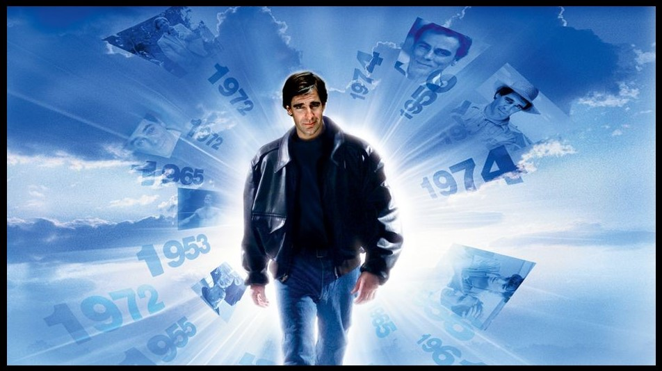

## YOUR MOVE

__Written by Hayley Igarashi__

__Published on https://blog.reedsy.com/__

__Genre: Fiction Mystery__

This is a story about a man who wants to kill you. I have my doubts, not about the man or about the story, but about you. I fear I do all this for nothing.

Listen: I would scream if I had a mouth. I have a story. So that is what I will use.

You have seen him before. He might as well live in your periphery. He is tall and seems to carry his weight in his chest and shoulders. He has a narrow waist and legs that taper down to small leather shoes.

Not that you've noticed any of this before. You've been distracted, haven't you? If I told you this same man walked by your home every day, paused to peer into your window, you wouldn't believe me. But you couldn't say for certain that I'm wrong.

I'm not wrong.

He might be very close right now. He might even be in your house. After all, there are so many excellent hiding places, aren't there? The back of a closet, behind the shower curtain, inside a cabinet...

But I'm getting ahead of myself. I promised you a story. And perhaps we still have time for it.

Understand : This man is not from your time. Spare me your disbelief. There are things beyond your comprehension. You are too old to think you know the universe.

Twenty years from now, this man lives on the coast with his five-year-old daughter. Their house, a patchwork creation of driftwood and corrugated metal, clings to the side of a rocky cliff. When the tide crashes in, the salt spray splashes against the windows. The sky's the color of steel, and the water is a foam-flecked black.

Everything is cold , harsh, and wet-except for inside the house. Warm yellow light spills out from a window, and a steady finger of smoke curls up from a slanted chimney.

Inside, the man reads to his daughter. He sits in a faded orange armchair by the fire, and she lays on her stomach in front of him, alternating her focus on the flames and the pages turning in her father's hands.

"When you finish this story, can you read another?"

He makes a show of looking at half the book that's still remaining and then looking back at her. "Already tired of this one?" She shakes her head. "No, I don't just want this one to be over. I don't want them to ever end."

He smiles and agrees, even though he knows she'll be asleep long before he'll have to pick out a new book. He knows how she feels. He doesn't want any of this to be over. He wants to hold onto every second, close his fingers around them and keep them safe, keep them from marching on.

And it is at that moment that everything goes white...a blast of blinding light that disintegrates the scene into dust, and then fades.

When the man comes to, he is wedged into the cliff's face, soaked, hanging a few feet above the waves. Above him, the remains of his house: a couple stumpy wooden beams and one amputated orange limb of his armchair. Below him, an inky black ocean.

His daughter is gone. He will search for her for a long, long time.

What he finally finds is not what he is looking for. He discovers a way to go back. But innovation is never as neat as any of us would like. He can only travel back a set number of years, way before his daughter is born.

So before he goes back, he does his homework. He researches. He spends hours in the archives of war museums, flipping through files, searching for someone new.

Searching for you.

And then he makes a leap, jumps back a few decades, emerges the same, if a little nauseous for a spell, into a world transformed. The colors seem brighter here, the smiles wider, flashing ferociously, the eyes emptier and hungrier.

But of course that's what he would see. Him, an interloper. Here, a brave old world.

On his third day back, he finds you, speaks to you. He asks you for the time. His hands are trembling; his eyes never leave yours. Do you remember? It was a year or so ago.

Your paths keep crossing, but he gets more cautious, becomes a flickering shadow, in and out of the corners of your life. Waiting. Watching.

So where is he now? Soon you might know better than me.

He is tightening his resolve now, like a noose.

Listen: You killed this man's daughter. Not yet, not now. Twenty years in the future. Will it make you feel better if I say it was for a "cause"? Or for the "'greater good"? It's true. At least it's true that you'll tell yourself that when the time comes.

I understand you are not a killer. Neither is this man with wide shoulders and tiny shoes who may be in your house right now. But the years change us. Stories change us. You will be protecting your family, your friends, when you send bombs across the sea. And he thinks, by killing you, he'll be avenging the memory of his daughter.

Maybe you still don't believe me. But think: Is there a limit to what you would do for love? is there any price too high to pay? You will have an answer for that soon, in the trying years ahead, whether you can face it now or not.

You two are very similar. Do you find that interesting? Relevant? Perhaps not. You both love words and tales and drama, mystery, and madness of being alive.

See: His story is partly your story, too.

But no more of this. I fear it may be too late, and I've done all I can. Please, listen.

Not to me.

A sound. Can you hear it? It's inside your home. Maybe the creak of a door or a soft muffled step on the carpet. Or a shallow inhale of breath that's not yours...

He is there, right now. Do not run. Do not call for help.

Remember the story. He doesn't want this one to end, not like this-and not deep down, not where it counts. Do you?

The shadow in the corner, It's not a shadow.

Okay. Your move.

   
## THE KEN OF EINSTEIN PENALTY TEST

[TEST LINK HERE](https://forms.gle/eV4d3LkXoibAxiCv6)